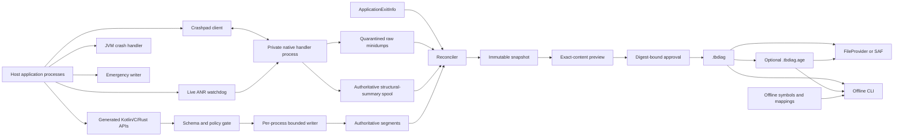

# Tracebox Architecture and Detailed Design

**Status:** Proposed  
**Version:** 0.1  
**Date:** 2026-07-17  
**Supported Android baseline:** API 23-37

## 1. Executive decision

Tracebox is an offline Android diagnostics recorder and user-controlled export system. It is not a telemetry or upload SDK.

The foundation release includes:

- generated, privacy-classified diagnostic events;
- per-process append-only storage;
- JVM crash capture;
- capture-only Crashpad in one private native handler process;
- a minimal async-signal-safe emergency writer;
- live ANR stall detection;
- post-restart `ApplicationExitInfo` reconciliation;
- deterministic `.tbdiag` package creation;
- offline validation, retracing, and native/Rust symbolication;
- user-controlled save and share without an `INTERNET` permission.

Crashpad and the live ANR watchdog are mandatory foundation capabilities. Metrics, distributed tracing, profiling, remote services, and automatic upload are not.

## 2. Goals

1. Preserve useful evidence for JVM, C/C++, Rust, and ANR failures.
2. Continue capturing when the application process is damaged.
3. Keep steady-state CPU, wakeups, memory, and disk usage tightly bounded.
4. Prevent unclassified values from entering ordinary diagnostic storage.
5. Give the user an exact preview of package content before export.
6. Work without Tracebox-owned networking or cloud infrastructure.
7. Decode and symbolicate packages entirely offline.
8. Fail explicitly rather than silently degrading privacy or inventing diagnostic facts.

## 3. Non-goals

- Product analytics, attribution, funnels, experimentation, or profiling users.
- Uploading, retrying uploads, remote configuration, or remote activation.
- Remote schema, key, symbol, decoder, or crash-report services.
- Perfect capture after `SIGKILL`, power loss, kernel failure, or catastrophic corruption.
- Isolation from trusted or compromised code running under the host application's UID.
- Protection against a rooted or fully compromised device.
- Guaranteed secure erasure from flash media.
- Sender authenticity based on a private key embedded in the application.
- Arbitrary attachments, screenshots, documents, request bodies, or heap dumps.
- Treating a watchdog observation as an Android-confirmed ANR.

## 4. Architectural principles

1. **Capture facts first; interpret later.**
2. **Crash-time work is fixed, bounded, and prearranged.**
3. **Each application process owns its write path.**
4. **Ordinary segments and bounded capture spools are authoritative; indexes are disposable.**
5. **Privacy policy is evaluated before ordinary persistence.**
6. **Raw Crashpad artifacts are quarantined sensitive evidence.**
7. **A preview is generated from the exact bytes that may be exported.**
8. **No networking abstraction exists in the runtime architecture.**
9. **Unsupported evidence remains raw and explicitly unresolved; it is never guessed.**
10. **Measured evidence controls performance budgets and supported-device claims.**

## 5. Terminology

| Term | Meaning |
|---|---|
| Process instance | One lifetime of one Android process, identified independently of PID reuse |
| Handler | The private native process hosting capture-only Crashpad |
| Emergency record | Fixed structural record written when Crashpad is unavailable or unsafe |
| Stall observation | A delayed main-looper acknowledgement |
| ANR candidate | Bounded evidence suggesting an ANR-like stall |
| Confirmed ANR | An OS record with `ApplicationExitInfo.REASON_ANR` |
| Structural summary | Allowlisted C0/C1 facts derived from a crash or ANR artifact |
| Raw artifact | Opaque or memory-bearing evidence such as a minidump or system trace |
| Snapshot | Immutable, transformed package content awaiting approval |
| Foundation | Required functionality for the first supported release |

## 6. Privacy model

### 6.1 Classes

| Class | Meaning | Examples | Default handling |
|---|---|---|---|
| C0 Essential | Low-risk structural facts needed for failure identification | Build IDs, signal, reason, ABI, bounded counters | Minimal Crash; Direct Boot eligible |
| C1 Operational | Bounded process/session diagnostic context | Generated outcomes, ephemeral correlation IDs, obfuscated frames | Standard Diagnostics |
| C2 Sensitive | Values or artifacts that may contain user/application content | Explicit text, paths, URLs, stack memory, raw minidumps | Enhanced session or explicit package selection |
| Prohibited | Secrets or unsuitable sources | Credentials, tokens, private keys, raw documents, payment data | No schema type or collection API |

Rules:

- Unknown custom fields default to C2.
- A prohibited source has no core collection API.
- No arbitrary maps, labels, event names, `Any`, object serialization, or implicit `toString()`.
- URL, path, filename, text, and structural symbol strings use separate bounded types.
- Throwable messages are excluded by default.
- Runtime secret-pattern checks are defense in depth, not a semantic guarantee.

### 6.2 Profiles

| Profile | Capture |
|---|---|
| Disabled | No new diagnostic writes; invalidate snapshots and purge library-owned data |
| Minimal Crash | C0/C1 crash core, emergency records, structural summaries, exit reconciliation |
| Standard Diagnostics | Minimal plus generated events, handled errors, and bounded breadcrumbs |
| Enhanced Diagnostic Session | Explicit, time-boxed C2 capture and raw-artifact eligibility |
| Custom | Granular rules that cannot enable Prohibited data |

### 6.3 Raw-artifact lifecycle

`RawArtifact` covers:

- Crashpad minidumps;
- nonfatal Crashpad snapshots requested for an ANR candidate;
- raw `ApplicationExitInfo` ANR traces;
- raw native tombstone streams.

| Profile | Creation | Retention | Package eligibility |
|---|---|---|---|
| Disabled | Prohibited | Purge pending and retained artifacts | None |
| Minimal Crash | Permitted only as transient input to structural extraction | Delete only after the structural summary is durably committed; startup cleanup recovers interrupted handoff/deletion | Structural summary only |
| Standard Diagnostics | Same as Minimal Crash | Same as Minimal Crash | Structural summary only |
| Enhanced Diagnostic Session | Permitted | CE-only, short TTL and separate hard quota | Explicit per-artifact selection |
| Custom | Controlled by an explicit C2 raw-artifact rule | Never longer or larger than hard platform limits | Explicit selection only |

Transient creation is still collection and is disclosed in the profile contract. Each artifact has a durable lifecycle marker:

```text
creating -> complete -> extracting -> summary_persisting -> summarized -> deleting -> deleted
     |          |           |             |
     +----------+-----------+-------------+-> delete_pending

any non-deleted state
  -- corruption / unsupported version / extraction failure
  -- policy tightening / expiry / quota eviction
  -> delete_pending -> deleting -> deleted
```

Before handler-generated capture data is written, the handler creates a durable journal entry containing:

```text
raw_artifact_id =
  cryptographically_random_id[256 bits]

origin_process_instance_id
origin_process_role
accepted_policy_epoch
```

The internal ID is never deliberately reused. It is mapped out-of-band in the handler journal to Crashpad's report UUID/path and is never placed in a Crashpad annotation, minidump stream, filename exposed to export, or opaque artifact bytes. Recovery always reuses the journaled identity and origin provenance. A Tracebox handler-generated raw file without a valid lifecycle journal has unverifiable provenance and is deleted without summary or export.

Raw artifact and summary IDs are internal storage identities. Tracebox never intentionally encodes them in `.tbdiag` manifests, paths, generated records, annotations, or custom Crashpad streams. During snapshot transformation, records receive deterministic package-local sequential IDs based on canonical entry/record ordering. Cross-references inside one package use only those package-local IDs.

Because opaque captured memory could coincidentally contain a known internal ID, selected raw artifacts are scanned for the binary ID and documented textual encodings of all live internal IDs. A match makes that raw artifact ineligible for export; Tracebox does not claim that arbitrary unknown transformations can be recognized.

Extraction has a small fixed attempt limit. Before append, the handler deterministically derives:

```text
summary_id = SHA-256(
  "tracebox-summary-v1"
  || raw_artifact_id
  || extractor_version
  || schema_fingerprint
  || canonical_summary_content_sha256
)
```

Before append:

1. The active versioned extractor writes a canonical summary body to a bounded staging file. The body excludes internal IDs, digests, lengths, and derivation metadata.
2. The staging file is flushed and its body length/content digest are computed.
3. `summary_id` is derived from the raw ID, extractor version, schema fingerprint, and content digest.
4. The artifact journal atomically stores the complete tuple, digest, length, ID, and staged-file reference.
5. The spool appends a fixed envelope followed by those exact staged body bytes.

Recovery after the journal commit never re-runs a different extractor: it reuses the staged bytes. A crash before the atomic journal commit leaves only an uncommitted temp file, which may be discarded and regenerated because no summary identity has yet been established. The summary contains both internal IDs and its content digest. Spool replay treats an existing `summary_id` as the same record rather than a second summary. A raw artifact reaches `summarized` only after the summary is durably appended and the artifact journal records commit completion.

The spool envelope contains:

```text
summary_id
raw_artifact_id
origin_process_instance_id
origin_process_role
extractor_version
schema_fingerprint
canonical_body_length
canonical_body_sha256
canonical_body_bytes
```

The body digest covers only `canonical_body_bytes`, removing any self-reference. Origin process identity is internal provenance, remains attached through spool import and deduplication, and becomes a package-local process reference during snapshot transformation.

Crash recovery handles every boundary:

- before append: retry the same deterministic ID;
- after append but before journal update: scan/replay finds the ID and repairs the journal;
- after journal update but before raw deletion: resume deletion;
- after raw deletion but before final journal update: the summary ID plus missing raw file completes recovery.

Corrupt, unsupported, expired, or repeatedly failing artifacts become immediately ineligible and transition directly to deletion without a summary. Failed summary persistence retains the raw artifact within quota and retries at bounded recovery triggers; it does not delete the only evidence. Failed unlink/delete remains `delete_pending`, blocks new raw-artifact creation when its hard quota is exhausted, and is retried only at bounded startup, maintenance, and explicit deletion triggers. It never becomes package eligible.

Precedence is explicit:

1. Prohibited/Disabled policy and user deletion override evidence retention; the raw artifact is deleted even if no summary can be committed.
2. Hard quota and hard TTL override evidence retention after the fixed extraction attempt/deadline budget; deletion emits only a bounded non-sensitive evidence-loss health code.
3. Corrupt or unsupported artifacts are deleted without summary.
4. Within those bounds, durable structural-summary persistence precedes transient raw deletion.

Tracebox prioritizes privacy and bounded storage over diagnostic availability when these requirements conflict.

Raw artifacts have two acquisition modes:

1. **Handler-generated**
   - Crashpad fatal minidump or requested nonfatal snapshot.
   - Uses the pre-capture lifecycle journal with exact origin process/role and accepted policy epoch.

2. **OS-imported**
   - `ApplicationExitInfo` ANR trace or native tombstone stream.
   - Android owns creation and retention; Tracebox cannot pre-journal it.
   - A stable source key is derived from documented exit fields: package/process name, defining UID, PID, timestamp, reason, status, importance, process-state-summary digest, and artifact kind.
   - Before copying bytes into Tracebox storage, the reconciler creates or reuses a journal keyed by that source key. It contains one random raw artifact ID, acquisition policy epoch, exit-record metadata, optional matched process provenance, and link confidence.
   - Raw stream import requires a valid process-state-summary token that maps to a known process instance and capture-time policy epoch where OS raw import was enabled.
   - Current policy must also permit the import. If either capture-time or current eligibility is absent, Tracebox records only approved structural exit metadata and does not copy raw bytes.
   - Unmatched or ambiguous OS exits never import raw C2 streams.

Deleting an OS-imported artifact deletes only Tracebox's local copy. `DeleteReport` states that Android's OS-owned original/history is unaffected.

OS import transaction:

```text
source_discovered
  -> journal_created_or_reused
  -> copying_to_temp
  -> temp_fsynced_with_digest
  -> journal_copy_complete
  -> atomic_promote
  -> journal_stored
  -> source_ledger_terminal
```

Tracebox does not use a monotonic OS-history watermark. `ApplicationExitInfo` history is bounded and may be reordered, so every reconciliation rescans the available bounded history and consults a source-key ledger.

The ledger records `pending`, `stored`, or a durable terminal skip reason. Recovery reuses the source-key journal and raw artifact ID. Partial temp copies are validated and resumed or discarded; they never become complete artifacts. If the OS stream disappears before completion, the journal records `source_unavailable` and no artifact is invented. A source-key collision with incompatible metadata is treated as ambiguous and skipped.

Equal timestamps, pagination/reordering, and late-visible sources are safe because processing is source-key based rather than cursor based. Terminal source keys are retained as compact exact tombstones for the lifetime of the Tracebox installation. They are not evicted based on visibility, time, reboot, or ordering assumptions. Tombstone storage has a hard entry/byte cap; when exhausted, Tracebox disables new OS raw-stream imports and reports degradation rather than evicting a key and risking duplicate or deletion backfill. Pending entries are never compacted away.

On handler or application restart, artifacts not eligible for retention resume extraction or deletion before accepting new raw-artifact work. A process death can delay physical deletion but cannot convert a transient artifact into an export-eligible artifact.

### 6.4 Crashpad privacy boundary

Useful native post-mortem unwinding normally requires stack memory. A raw Crashpad minidump therefore cannot be treated as an ordinary allowlisted record.

Tracebox uses two outputs:

1. **Structural summary**
   - Generated from reviewed minidump streams.
   - Contains exception metadata, generated thread-role identifiers, module build IDs, and normalized module-relative instruction/frame addresses.
   - Excludes raw general-purpose registers, raw stack pointers, stack bytes, memory ranges, and arbitrary annotations.
   - Classified C0/C1.
   - Eligible for Minimal Crash and normal package workflows.

2. **Raw minidump**
   - May contain stack memory and other opaque values.
   - Classified C2 as a whole.
   - Stored only in credential-encrypted app-private storage.
   - Has a separate, short quota and retention period.
   - Is never included in a Standard package.
   - Requires explicit Enhanced selection and a prominent disclosure warning.

Tracebox does not claim that it can prove a raw artifact contains no secret.

Every structural-summary field must pass seeded-secret negative tests. A value is not safe merely because it is fixed-width.

## 7. System context



## 8. Process model

### 8.1 Application processes

Every initialized process owns:

- a process-instance ID;
- policy generation and generated schema;
- bounded queues and breadcrumbs;
- active and sealed segment files;
- one emergency-record reserve;
- Crashpad client registration;
- a live ANR watchdog only when that process has eligible Android components.

No process appends to another process's ordinary segments.

### 8.2 Handler process

One non-exported service runs in `:tracebox_handler`.

Properties:

- Same UID as the application; no isolation claim.
- Native-only after minimal Android service bootstrap.
- Hosts capture-only Crashpad and bounded local IPC.
- Blocks waiting for client or capture events.
- Performs no periodic polling, upload, DNS, HTTP, remote configuration, or scheduled maintenance.
- Does not initialize ordinary Tracebox recording.
- Does not run its own ANR watchdog.
- Attributes every artifact to the originating process instance and quota.
- Owns a bounded append-only structural-summary spool for handler-derived C0/C1 records.

The summary spool is a capture store, not a general event recorder. Only generated handler summary types may be appended. The reconciler imports summary IDs idempotently into ordinary process-role storage when possible.

Import retirement follows a strict durable sequence:

1. Append the summary ID and record to the target process-role segment.
2. Flush/seal according to the target durability contract.
3. Persist an import acknowledgement containing source spool ID, target segment ID, offset, and summary ID.
4. Only then tombstone or retire the source spool record.

Recovery:

- before target append: retry;
- after target append but before acknowledgement: scan by summary ID and create the acknowledgement;
- after acknowledgement but before source retirement: retire the source;
- duplicate source and target records are deduplicated by summary ID.

The spool remains authoritative until the durable acknowledgement exists. Source retirement can never delete the only durable summary.

Summary spools are segmented by originating process role and policy epoch. Every record has a deterministic summary ID.

The exact Crashpad launch and attachment model is a feasibility gate because Android OEM, SELinux, `ptrace`, and lifecycle behavior may differ.

### 8.3 Initialization

Explicit initialization in `Application.attachBaseContext()` is primary.

An optional non-exported provider may install only:

- immutable generated configuration;
- the JVM uncaught-exception wrapper;
- volatile breadcrumb storage;
- minimal handler startup/connection;
- the emergency fallback.

It must not silently choose a privacy profile or perform main-thread disk I/O.

### 8.4 Readiness states

| State | Meaning |
|---|---|
| VolatileCapture | Policy and handlers are installed; durable stores are not fully ready |
| Durable | Segments, reserves, handler registration, and emergency fallback are operational |
| Degraded | Capture continues with one or more unavailable capabilities |
| Closed | New recording is rejected; safe chaining and cleanup remain |

`install()` reaching `VolatileCapture` does not imply durable capture.

### 8.5 Global policy coordination

Ordinary record appends remain brokerless, but the mandatory handler process coordinates package-wide policy.

1. The handler owns a versioned shared control page containing the active policy epoch and deny mask.
2. Every durable writer maps the control page read-only and checks the epoch/mask before enqueue.
3. Every queued record carries the policy epoch under which it was accepted.
4. The segment writer revalidates the epoch and deny mask immediately before append; stale disallowed records are dropped rather than persisted.
5. For tightening, every participant first writes a restrictive process-state-summary token for the target epoch and acknowledges the staged token. A tightening affecting Direct Boot C0 also writes the DE `pending_deny` mirror.
6. After all live participants stage the restrictive token, tightening commits the persistent CE policy, atomically updates the control page, invalidates snapshots, and requests a queue barrier.
7. At the barrier, each writer pauses dequeue, drops now-disallowed queued records, seals any segment that cannot accept the new epoch, reloads policy, and then acknowledges.
8. For loosening, permissive process-state-summary tokens are written only after the coordinated CE policy commit and barriers succeed.
9. Handler extraction jobs and summaries also carry their accepted policy epoch. Before summary append, the handler revalidates against the control page.
10. At its barrier, the handler stops accepting new raw/summary work, revalidates or drops in-flight summaries, seals an incompatible spool segment, applies raw-artifact retention changes, and then acknowledges.
11. `updateProfile()` returns success only after all registered live writers and the handler cross the barrier and acknowledge the new epoch.
12. A stale writer rejects new records until it reloads the policy.
13. If the coordinator is unavailable or acknowledgements time out, the caller tightens locally but receives a partial/failure result; package-wide success is not reported.
14. New processes cannot become `Durable` until they load the latest committed epoch.

A permissive OS token authorizes raw import only when its epoch was durably committed before the exit timestamp. A restrictive or uncommitted future-epoch token always denies raw import.

Participant registration is fenced by the same transition mutex:

- a process joining during tightening remains `VolatileCapture`, receives the pending restrictive token/epoch, joins the acknowledgement set, and cannot become `Durable` until commit/barrier completion;
- a process joining during loosening receives the currently committed restrictive token and remains `VolatileCapture` until loosening completes;
- registration cannot observe an intermediate combination of control page, CE policy, DE mirror, or token state;
- transition success includes every participant admitted before the commit point.

Deletion and Disabled semantics are package-wide only after a successful coordinated transition. The delete report lists unreachable or unacknowledged process instances and always states that OS-owned exit history is unaffected.

Coordinator liveness is part of persistence safety:

- every writer treats handler/control-channel death as an immediate transition to `Degraded`;
- ordinary C1/C2 persistence fails closed until the writer reconnects and maps the current epoch;
- only the immutable fixed C0 emergency fallback remains available while disconnected;
- every writer holds a native exclusive lock on a per-instance lease file for its lifetime;
- the coordinator persists a participant census containing boot session, process role, process-instance ID, lease path, and last acknowledged epoch;
- after coordinator restart, prior participants are `UNVERIFIED` until they reconnect or the coordinator acquires their lease lock non-blockingly;
- acquiring the lease proves the prior writer is gone and permits a durable census tombstone; an unavailable or ambiguous lease remains `UNVERIFIED`;
- a reboot changes the boot session and releases every prior lease;
- a package-wide policy update cannot report success while any live or unverified prior participant lacks the target acknowledgement.

## 9. Module design

```text
Tracebox/
├─ build-logic/
├─ specs/
├─ adr/
├─ schema/
├─ tooling/
│  ├─ schema-model/
│  ├─ schema-compiler/
│  └─ tracebox-gradle-plugin/
├─ android/
│  ├─ tracebox-api/
│  ├─ tracebox-core/
│  ├─ tracebox-storage/
│  ├─ tracebox-jvm-crash/
│  ├─ tracebox-anr-exit/
│  ├─ tracebox-native/
│  ├─ tracebox-export/
│  ├─ tracebox-export-ui/
│  ├─ tracebox-init-provider/
│  ├─ tracebox-directboot/
│  ├─ tracebox-age/
│  ├─ tracebox-testing/
│  └─ tracebox/
├─ native/
│  ├─ include/tracebox/
│  ├─ client/
│  ├─ emergency/
│  ├─ handler/
│  └─ crashpad/
├─ rust/
│  ├─ tracebox-sys/
│  ├─ tracebox/
│  ├─ tbdiag-format/
│  ├─ tbdiag-symbols/
│  ├─ tbdiag-age/
│  └─ tbdiag-cli/
├─ third_party/crashpad/
├─ test-apps/
└─ benchmarks/
```

### 9.1 Published artifacts

| Artifact | Responsibility | Foundation |
|---|---|---|
| `tracebox` | Aggregated supported runtime | Required |
| `tracebox-api` | Stable API and generated values | Required |
| `tracebox-storage` | Segments, quotas, retention | Required |
| `tracebox-jvm-crash` | JVM crash capture | Required |
| `tracebox-native` | Crashpad client/handler and emergency fallback | Required |
| `tracebox-anr-exit` | Live watchdog and exit reconciliation | Required |
| `tracebox-export` | Snapshot, package, save/share | Required |
| `tracebox-export-ui` | Tracebox-owned disclosure and approval activity | Required |
| `tracebox-init-provider` | Minimal automatic installation | Optional |
| `tracebox-directboot` | C0-only Direct Boot capture | Optional |
| `tracebox-age` | Recipient encryption | Optional and gated |
| `tracebox-testing` | Deterministic test harness | Optional |

## 10. Generated schema and API

One schema compiler generates:

- Kotlin event and value types;
- C and C++ structs/functions;
- Rust bindings and wrappers;
- protobuf-compatible record messages;
- decoder metadata;
- disclosure labels;
- schema documentation and lint rules.

Required schema metadata:

- stable numeric event and field IDs;
- privacy class;
- category;
- semantic type;
- maximum encoded size;
- retention eligibility;
- redaction/transformation rule;
- package visibility;
- Direct Boot eligibility;
- evolution rules.

IDs are never reused.

### 10.1 Kotlin surface

```kotlin
enum class Readiness {
    VOLATILE_CAPTURE,
    DURABLE,
    DEGRADED,
    CLOSED,
}

interface TraceboxHandle : Closeable {
    val diagnostics: Diagnostics
    val readiness: StateFlow<Readiness>
    val packages: DiagnosticPackages

    fun updateProfile(profile: DiagnosticsProfile): PolicyUpdateResult
    fun delete(request: DeleteRequest): DeleteReport
}

interface Diagnostics {
    fun breadcrumb(value: GeneratedBreadcrumb, context: DiagnosticContext? = null)
    fun handled(value: GeneratedHandledError, throwable: Throwable? = null)
}
```

Generated functions check enablement before constructing values. No generic `record(name, fields)` API exists.

Production approval tokens are created only by the non-exported Tracebox disclosure activity. The public package API accepts an opaque approval token but does not expose a constructor or headless approval method. Test-only approval is confined to `tracebox-testing`.

### 10.2 Native ABI

Every public struct starts with:

```c
typedef struct {
    uint32_t struct_size;
    uint32_t abi_version;
} tb_header_v1;
```

Rules:

- versioned symbol names;
- size-prefixed append-only structs;
- fixed arrays or bounded pointer/length pairs;
- generated enums;
- no formatting API;
- no arbitrary map or string API in crash-sensitive paths;
- typed status values including `NOT_READY`, `DROPPED`, and `UNSUPPORTED_VERSION`.

Rust exposes a thin safe wrapper and contains unwinding panics at every C/JNI boundary.

### 10.3 Internal identity contract

| Identity | Generation | Persist-before-use rule | Reuse | Package representation |
|---|---|---|---|---|
| Process instance | Random 256-bit | Lease/census record before writer activation | Never | Package-local process number |
| Ordinary segment | Random 256-bit | Header created and synced before first frame | Never | Package-local segment number |
| Raw artifact | Random 256-bit | Handler lifecycle journal before capture bytes | Never | Package-local artifact number; internal ID absent from bytes/path |
| Summary | SHA-256 of frozen artifact/extractor/schema tuple | Tuple and ID journaled before spool append | Same tuple intentionally deduplicates | Package-local record number |
| Summary spool segment | Random 256-bit | Header created and synced before first summary | Never | Not exported |
| Snapshot | Random 256-bit | Snapshot journal before entry materialization | Never | Not exported; approval uses opaque token |
| Emergency record | Process-instance ID plus monotonic slot sequence | Slot header written before completion marker | Sequence never reused in one instance | Package-local record number |
| Coordinator boot session | Random 256-bit after reboot detection | Control journal before accepting participants | Replaced only after a detected reboot | Never exported |
| OS exit-correlation token | Random 128-bit plus policy epoch/capability bits per process instance | Process lease before `setProcessStateSummary()` and refreshed at policy barriers | Random token never reused | Matched and stripped; package-local link only |

Policy epochs are monotonically increasing persisted counters, not identities. Build IDs and schema fingerprints are content/provenance identifiers intended for export and are governed separately.

Reboot detection uses the platform boot count when available plus a persisted elapsed-realtime watermark. Ambiguity creates a new boot-session ID and conservatively invalidates prior live-participant assumptions; lease locks still provide the process-death proof.

The OS exit-correlation token is C1, is placed only in the bounded process-state summary, and is stripped after matching. It carries the policy epoch and an OS-raw-import eligibility bit protected by the generated fixed encoding. An `EXACT` link requires the token plus compatible process role, boot session, and time evidence. Tracebox cannot delete the OS-owned copy and reports that limitation.

All internal random IDs use the platform CSPRNG. Failure to obtain randomness prevents creation of the corresponding durable object.

## 11. Ordinary persistence

### 11.1 Source of truth

Per-process append-only segments and the handler's emergency/structural-summary spools are authoritative. SQLite, if introduced, is a rebuildable metadata index containing no unique diagnostic values. Package preparation and recovery must work directly from these stores.

### 11.2 Segment format

```text
segment-header:
  magic
  format-version
  segment-id
  process-instance-id
  schema-fingerprint
  policy-generation
  flags
  future-encryption-fields
  header-crc32c

frame:
  little-endian-length
  record-type
  sequence
  payload
  crc32c

segment-seal:
  final-sequence
  frame-count
  content-sha256
```

Properties:

- strict length checks before allocation;
- monotonically increasing process-local sequence;
- interrupted tails are discarded after the last valid frame;
- sealed segments are immutable;
- one corrupt segment cannot invalidate unrelated segments;
- new process instances never resume an old nonce or sequence domain.

### 11.3 Quotas

Hard ordinary-record quotas are assigned to generated stable process roles, not process instances. A restarted process inherits the same role quota and must rotate eligible records from earlier instances before extending the role's store.

The hard UID-wide bound is:

```text
sum(declared process-role quotas)
  + handler raw-artifact quota
  + handler structural-summary spool quota
  + snapshot/staging quota
  + one maximum-segment compaction workspace
  + fixed emergency reserve
  + bounded metadata/control reserve
```

Unknown process roles receive no ordinary storage unless an explicit bounded fallback role is configured. Aggregate retention targets below the hard bound may still be enforced opportunistically.

Every byte and file counts toward exactly one hard quota or reserve. The metadata/control reserve includes lifecycle journals, summary staging, import acknowledgements, policy/census/lease records, deletion journals, snapshot journals, index files, manifests, and temporary atomic-replacement files. Each metadata type has a maximum file count and maximum encoded size. A rebuildable index that cannot fit is deleted/disabled rather than exceeding the reserve.

Priority order:

1. crash and ANR evidence;
2. policy and health records;
3. handled errors;
4. breadcrumbs;
5. ordinary events.

All raw artifacts use the handler C2 quota and cannot consume ordinary, emergency, summary, or snapshot reserves. Structural summaries use their own bounded handler spool charged to the originating process role.

Snapshot and share staging have a separate hard quota. By default, only one prepared snapshot may exist; a new preparation must fit without exceeding the staging bound.

One global compaction operation may run at a time. Its workspace is pre-reserved and cannot be consumed by recording, raw artifacts, summaries, or snapshots. Compaction processes one bounded segment at a time, so the replacement can never exceed the reserved maximum-segment workspace.

### 11.4 At-rest protection

Foundation storage uses credential-encrypted `noBackupFilesDir`.

C0 Direct Boot capture:

- is opt-in;
- uses device-protected storage;
- has a separate generated schema;
- structurally rejects C1/C2.

Device-protected storage also contains a minimal fail-closed deny-policy mirror:

- policy epoch;
- Disabled flag;
- C0 category deny mask;
- integrity/version fields.

Any tightening that affects C0 or selects Disabled uses a fail-closed two-phase sequence:

1. Write and sync a DE `pending_deny` mirror carrying the target epoch/mask.
2. Direct Boot readers immediately apply the more restrictive active or pending mirror.
3. Commit the CE policy and complete the global writer/handler barrier.
4. Promote the pending mirror to active.

A crash at any boundary leaves the DE side at least as restrictive as the requested tightening. Loosening reverses the order: CE commit and global coordination complete first, and only then may the DE mirror become less restrictive.

Direct Boot capture is disabled when the mirror is absent, corrupt, or newer than the runtime understands. After unlock, the CE policy is reconciled with both active and pending mirrors; the most restrictive state wins until recovery completes. Disabled deletion includes DE C0 records and the mirror is retained only as the deny marker needed to prevent capture on the next locked boot.

Application-layer C1/C2 segment encryption is a release-following experiment unless device qualification proves it reliable enough for foundation. When enabled:

- one random DEK per segment;
- AES-GCM with unique per-frame nonces;
- Keystore-wrapped keys;
- no plaintext fallback;
- no claim of protection from same-UID code.

Raw artifacts, snapshots, and share staging remain CE-only and have short retention even before this optional layer is enabled.

### 11.5 Deletion protocol

Deletion uses a crash-recoverable journal:

```text
requested
  -> deny_committed
  -> writers_quiesced
  -> stores_marked_ineligible
  -> deleting
  -> complete | pending_failure
```

For `Disabled`:

1. Commit the Disabled epoch and cross the global queue barrier.
2. Prevent new ordinary and raw-artifact creation.
3. Invalidate approvals and snapshot keys.
4. Close active segments and emergency/raw-artifact files.
5. Mark all library-owned records ineligible before physical deletion.
6. Delete active/sealed segments, structural-summary spools, raw artifacts, emergency reserves, indexes, snapshots, share staging, and rebuildable metadata.
7. Persist completion only after no remaining library-owned path is readable through Tracebox.

Selective deletion:

- deletes whole segments when all records are in scope;
- may sacrifice an entire mixed segment to provide prompt deletion;
- may use bounded rewrite/compaction only when the caller explicitly prioritizes preservation of unaffected records;
- writes an authoritative summary-ID tombstone before deleting a selected structural summary;
- applies the same tombstone to both handler-spool and imported ordinary copies;
- compacts mixed summary-spool segments by writing and sealing a new live-record segment, atomically switching the spool manifest, and only then deleting the old segment;
- invalidates every snapshot containing an affected record.

Tombstoned summary bytes continue to count against the hard spool quota until compaction removes them. Package planning and reconciliation exclude tombstoned IDs immediately. Deletion failure remains `pending_failure`, is visible in `DeleteReport`, and resumes on bounded startup, maintenance, and explicit retry triggers. Disabled never reports completion while any library-owned data remains accessible; selective deletion never reports completion while any in-scope summary ID or other in-scope data remains accessible from either authoritative or imported stores. Unlinking cannot guarantee secure flash erasure, and OS-owned `ApplicationExitInfo` history remains unaffected.

## 12. Crash capture

### 12.1 Capture hierarchy

1. Crashpad separate-process capture.
2. Minimal emergency record if Crashpad is unavailable, unregistered, timed out, or conflicts.
3. `ApplicationExitInfo` after restart.
4. Android debuggerd/tombstone behavior remains intact where possible.

### 12.2 Crashpad lifecycle

1. Start the private handler service.
2. Bootstrap its native loop.
3. Establish bounded local IPC.
4. Register each application process and process-instance ID.
5. Pre-register build identity and generated annotations.
6. Transition the client to `Durable` only after both Crashpad and the emergency descriptor are ready.
7. If handler IPC dies, transition to `Degraded` and use the emergency path.
8. Reconnect only on lifecycle or capture-triggered events; never poll.

### 12.3 Capture policy

The pinned Crashpad revision and patches must:

- exclude uploader and network functionality from the build graph;
- bound report count and size;
- support 4 KiB and 16 KiB page devices;
- preserve exact build IDs and module ranges;
- permit structural-summary derivation;
- keep raw reports private and quota-bound;
- preserve or deliberately chain Android's normal crash handling.

Any additional memory regions are prohibited unless approved in a later ADR.

### 12.4 Handler coexistence

Supported policies:

| Policy | Behavior |
|---|---|
| Exclusive | Tracebox owns supported fatal signals |
| BestEffortChain | Preserve prior actions and invoke/re-raise only through a reviewed path |
| DisableOnConflict | Keep JVM/exit capture and disable native Crashpad capture |

Tracebox cannot guarantee safe coexistence with every third-party handler. The active policy and detected conflict are surfaced in readiness and package metadata.

### 12.5 Emergency record

The emergency writer uses:

- preallocated slots;
- a preopened descriptor;
- fixed-width little-endian fields;
- an alternate signal stack where available;
- a recursion guard;
- one bounded positional write;
- checksum and completion marker.

The emergency record is an allowlisted C0/C1 structural format, not a `RawArtifact`. It contains no stack bytes or general-purpose register file. Architecture-specific control values are restricted to the minimum needed for later normalization, such as the faulting instruction address and link/return address when valid.

Alternate signal stacks are registered per thread. Tracebox registers its own native threads and exposes an explicit native/Rust thread-attachment API. Stack-overflow fallback is guaranteed only for registered threads; it is best effort for other host-created threads. Crashpad remains the primary stack-overflow capture mechanism.

It does not:

- allocate;
- unwind;
- call JNI;
- lock application mutexes;
- query SQLite;
- compress or encrypt;
- read arbitrary strings or stack memory.

## 13. Live ANR design

### 13.1 Objective

Detect and preserve evidence for main-thread stalls before the process is killed, with negligible steady-state overhead and explicit false-positive handling.

### 13.2 Architecture

The watchdog covers main-looper stalls and runs inside each eligible application process:

- one daemon/native-capable watchdog thread;
- one main-looper heartbeat token;
- monotonic timestamps and atomic generation counters;
- no handler-process polling;
- no periodic thread-dump capture;
- one rate-limited handler request only after a credible stall.

The Crashpad handler remains blocked until a client requests a nonfatal snapshot.

### 13.3 Adaptive operating modes

| Process state | Behavior |
|---|---|
| Foreground interactive | Regular heartbeat and full candidate logic |
| Foreground non-interactive | Reduced heartbeat frequency |
| Active service/receiver | Component-specific policy; never reuse input-dispatch timeout blindly |
| No observable eligible component | Suspended |
| Debugger attached | Candidate generation suppressed or marked debugger-affected |

Android's internal cached-process classification is not directly observable as an exact lifecycle callback. Tracebox bases eligibility on observable activity, service, receiver, and provider state and does not claim perfect alignment with the OS cached state. Exact intervals are measured configuration, not API constants.

### 13.4 Detection state machine

```text
Healthy
  -> heartbeat acknowledgement delayed
SuspectedStall
  -> validate lifecycle, debugger, suspend gap, startup grace, rate limit
CredibleStall
  -> capture bounded local main-thread evidence
  -> optionally request one nonfatal Crashpad snapshot
CapturedCandidate
  -> main thread recovers: record recovered stall
  -> process exits: reconcile with ApplicationExitInfo
ConfirmedAnr
  -> only when OS reason is REASON_ANR
```

### 13.5 Evidence levels

| Level | Evidence | Label |
|---|---|---|
| 0 | Delayed heartbeat only | Stall observation |
| 1 | Repeated delay plus bounded main-thread samples | ANR candidate |
| 2 | Candidate plus nonfatal handler snapshot | High-confidence candidate |
| 3 | `ApplicationExitInfo.REASON_ANR` | Confirmed ANR |
| 4 | Confirmed ANR plus API 37 `AnrInfo` | Confirmed and classified |

### 13.6 Candidate capture

On a credible stall:

1. Record lifecycle and component context using generated enums.
2. Record elapsed and wall-clock time with discontinuity flags.
3. Capture the main-thread stack using a bounded representation.
4. Capture at most a small fixed number of spaced samples.
5. Request at most one nonfatal Crashpad snapshot per rate window.
6. Record whether CPU starvation, debugger attachment, startup, suspend/resume, or handler unavailability affected confidence.

Full-thread captures are not periodic and are enabled only if measurements show acceptable cost.

Main-looper responsiveness does not cover every Android ANR. Async receiver completion, providers, binder pools, and component-specific timeout failures may occur while the main looper remains responsive. Those cases are captured through `ApplicationExitInfo` reconciliation and dedicated OS-ANR fixtures rather than claimed as live-watchdog coverage.

### 13.7 False-positive controls

- startup grace period;
- debugger suppression;
- monotonic suspend-gap detection;
- foreground/component eligibility;
- adaptive thresholds;
- per-process token bucket;
- duplicate stack-signature suppression;
- no confirmation without OS evidence;
- separate classification of runnable-but-unscheduled versus blocked evidence when available.

### 13.8 Expected overhead

Non-negotiable:

- no disk I/O per heartbeat;
- no allocation after warm-up;
- no cross-process request while healthy;
- no heartbeat while no observable eligible component is active;
- no wakelock.

Provisional measurement targets:

| Metric | Initial target |
|---|---:|
| Main-thread heartbeat work | Under 50 microseconds |
| Foreground watchdog CPU | Under 0.2% |
| Foreground wakeups | At most 30/minute |
| Ineligible-state wakeups | Zero when suspended |
| App-process retained memory | Under 512 KiB plus thread stack |
| Nonfatal handler request | At most one per 10 minutes/process by default |

These numbers are not release promises until measured on the required qualification emulator.

## 14. Exit reconciliation

`ApplicationExitInfo` is read after startup and opportunistically during package preparation.

The reconciler:

- rescans bounded OS history and uses the exact source-key ledger for idempotency;
- handles bounded OS history and missing trace streams;
- requests a bounded non-sensitive process-instance/build fingerprint through `ActivityManager.setProcessStateSummary()` when available;
- correlates process name, timestamp, reason, PID, process-state summary, and local process-instance evidence;
- treats PID as non-unique across time;
- preserves unmatched evidence;
- stores watchdog candidates and OS exits as separate records connected by an explicit `UNMATCHED`, `POSSIBLE`, `PROBABLE`, or `EXACT` link;
- never changes a watchdog candidate into a confirmed record solely because a later ANR exit exists;
- does not backfill data disallowed by the active policy;
- reports that OS-owned exit history cannot be deleted by Tracebox.

API behavior:

- API 23-29: local Tracebox evidence only; OS exit-history import is unavailable.
- API 30+: exit reasons and ANR trace when retained.
- API 31+: native tombstone stream when retained.
- API 37+: structured `AnrInfo` when present.

OS artifacts are parsed only through documented schemas and then transformed into generated records. Raw traces and tombstones use the same `RawArtifact` lifecycle, CE-only store, hard quota, TTL, profile rules, and export restrictions as Crashpad minidumps.

## 15. Package and disclosure design

### 15.1 Format

- Plain: `*.tbdiag`, `application/zip` fallback.
- Encrypted: `*.tbdiag.age`, `application/octet-stream`.
- Normative manifest: deterministically encoded CBOR.
- Bulk records: generated protobuf-compatible messages.

### 15.2 V1 limits

| Limit | Value |
|---|---:|
| Default plaintext size | 64 MiB |
| Hard plaintext size | 128 MiB |
| Archive entries | 128 |
| Ordinary record | 16 KiB |
| Emergency record | 4 KiB |
| Nested archives | Prohibited |
| ZIP64 | Prohibited |
| Symlinks/devices | Prohibited |
| In-ZIP encryption | Prohibited |
| Arbitrary attachments | Prohibited |

Paths are normalized relative UTF-8 paths with strict byte limits. Absolute paths, drive prefixes, `..`, backslashes, NULs, duplicates, comments, and unknown extra fields are rejected.

### 15.3 Snapshot workflow

1. Freeze source sequence cutoffs and policy generation.
2. Validate, decrypt where applicable, filter, redact, and omit corruption.
3. Materialize the complete deterministic plaintext `.tbdiag`.
4. Compute the plaintext package SHA-256.
5. Decode the exact package into the disclosure preview.
6. Bind approval to digest, request, policy, protection, and recipients.
7. Copy the exact file or encrypt the entire file.
8. Emit a final outcome receipt.

Generation after approval cannot add, remove, or transform content. Any mismatch invalidates the operation.

Prepared snapshots are:

- stored only in CE `noBackupFilesDir`;
- charged to the hard snapshot/staging quota;
- classified at the maximum privacy class of their contents;
- encrypted with an ephemeral snapshot key when application-layer snapshot encryption is enabled;
- invalidated by tightening, deletion, expiry, recipient changes, or profile changes;
- removed by crash-recoverable startup cleanup and bounded TTL processing.

### 15.4 Disclosure

Exact facts:

- included values;
- counts and sizes;
- privacy classes;
- transformations and omissions;
- source process and time ranges;
- plaintext digest;
- entry hashes;
- recipient labels and fingerprints;
- raw C2 artifacts selected.

Opaque raw-artifact bytes are copied without injecting Tracebox internal IDs. Their package entry names and cross-references use package-local IDs only. A raw artifact matching a known live internal ID encoding is rejected from export.

Warnings:

- semantic secrets may still exist in explicitly approved C2 data;
- OS traces may be missing;
- wall-clock time is not trusted;
- a recipient or external document provider may retain or upload the package;
- an offline embedded public key cannot be remotely revoked;
- encrypted envelope size remains visible.

### 15.5 Final receipt

The receipt records:

- approved plaintext digest;
- output digest and size;
- plaintext/encrypted mode;
- recipients;
- generation result;
- save result;
- share handoff state: `NOT_STARTED`, `CHOOSER_OPENED`, `TARGET_SELECTED` when observable, or `DELIVERY_UNKNOWN`;
- cancellation result when observable;
- SAF partial-copy warning;
- staging expiry.

Android does not provide proof that a share target received or retained the bytes. The receipt never reports successful delivery and never legitimizes changed content.

## 16. Recipient encryption

Age v1 X25519 is the preferred optional format because it provides an externally specified interoperable file envelope.

Production enablement requires:

- pinned specification and implementation;
- X25519-only bounded recipient profile;
- CCTV vectors;
- differential interoperability with Go `age` and Rust `rage`;
- malformed-header and chunk fuzzing;
- qualification on the ADR-0009 required emulator lane;
- independent cryptographic review;
- no plugin, SSH, passphrase, armor, or network extension in Android v1;
- no silent downgrade to plaintext.

Until these gates pass, explicit plaintext export remains supported.

## 17. Save and share

Sharing:

- non-exported `FileProvider`;
- one narrow staging directory;
- explicit read grant and `ClipData`;
- Android Sharesheet;
- bounded staging lease and TTL.

The Tracebox-owned, non-exported disclosure activity renders the exact decoded preview and creates the opaque approval token after explicit confirmation. Hosts may theme documented resources but cannot bypass the production approval-token flow through public API.

Saving:

- `ACTION_CREATE_DOCUMENT`;
- canonical package finalized internally first;
- background copy with progress and cancellation;
- no claim that an arbitrary SAF provider is atomic or offline.

Tracebox itself requires neither `INTERNET` nor broad storage permission.

## 18. Offline developer tooling

The Rust CLI provides:

```text
tbdiag inspect
tbdiag validate
tbdiag decode
tbdiag filter
tbdiag retrace
tbdiag symbolize
tbdiag decrypt
tbdiag key generate
tbdiag key public
tbdiag key fingerprint
```

Security requirements:

- bounded streaming parsing;
- no path extraction by default;
- no plugins or network access;
- subprocess isolation for external symbol tools;
- CPU, memory, file-count, and decompression limits;
- exact build/ABI/hash matching;
- hard failure instead of guessed symbols.

## 19. Build integration

The Gradle plugin uses public AGP Variant and Artifact APIs to:

- generate and validate schemas;
- verify `minSdk` and `compileSdk`;
- capture application/build/schema identity;
- collect R8 mapping ID and hash;
- collect ELF build IDs and symbols;
- generate recipient and key provenance;
- verify dependency locks;
- inspect merged manifests;
- fail release variants on forbidden dependencies or permissions.

An AAR cannot control the host's final `targetSdk`; the plugin reports and
verifies the observed host configuration.

## 20. No-network guarantee

The exact claim is:

> Tracebox-owned runtime and tooling artifacts introduce no network
> permission, networking dependency, uploader, exporter, remote configuration,
> or observed runtime network attempt in personal-release paths.

It is not a claim that the host app, share target, or SAF provider is offline.

Release gates:

- no Tracebox-owned `INTERNET` permission;
- dependency allowlist and verification;
- no HTTP/socket/DNS client packages in the runtime closure;
- DEX and native-import scans;
- no uploader code in the Crashpad build;
- blocked-egress runtime exercise with a working control probe;
- host fixtures with and without host-owned networking;
- packet and DNS observation during capture, export, encryption, save, and share preparation.

## 21. Reliability behavior

| Failure | Required behavior |
|---|---|
| Handler unavailable | `Degraded`; emergency capture remains |
| Handler dies | Detect through IPC death; no polling; reconnect on defined triggers |
| Emergency write fails | Re-raise/chain immediately |
| Storage full | Preserve reserves; drop lower priorities with bounded health code |
| Partial segment | Keep valid prefix |
| Corrupt segment | Quarantine affected data only |
| Missing index | Scan segments and rebuild lazily |
| Keystore unavailable in enabled encrypted mode | Stop protected writes; never write plaintext |
| Crash during package preparation | Leave unapproved partial state; clean later |
| Policy tightens during preview | Invalidate snapshot and approval |
| Deletion cannot remove all library-owned data | Return pending failure; retain deny state and retry journal |
| Encryption fails | Abort encrypted output; never create plaintext fallback |
| Symbols mismatch | Preserve raw addresses and return hard mismatch |
| Handler conflict | Apply configured coexistence policy and report degradation |
| ANR candidate recovers | Store recovered-stall evidence, not confirmed ANR |

## 22. Performance governance

### 22.1 Architectural invariants

- No ordinary main-thread disk I/O.
- No handler polling or timer-driven maintenance.
- No wakelock.
- No network operation.
- No unbounded queue, record, parser, archive, or retry.
- No crash-time compression, encryption, SQLite, or complex JNI.
- Hard role and UID-wide storage bounds are never exceeded.
- ANR heartbeat is suspended when no observable eligible component is active.

### 22.2 Provisional budgets

| Area | Initial target |
|---|---:|
| Install to VolatileCapture | p95 <= 2 ms |
| Cold transition to Durable | p95 <= 500 ms |
| Enabled small record | p99 <= 15 microseconds |
| Core app-process retained heap | <= 3 MiB |
| Handler idle PSS | <= 12 MiB provisional ceiling |
| Handler idle CPU | Below measurable noise |
| Handler timer wakeups | Zero without IPC |
| Native compressed size | <= 4 MiB per ABI provisional |
| Fatal capture completion | p95 <= 2 seconds |
| Package working memory | <= 8 MiB beyond output buffers |

Budgets may change only from measured evidence and an ADR update. Invariants may not be relaxed through tuning.

ADR-0010 supplies that update for the personal-project release: the table is a
set of tuning and regression targets rather than a release-blocking percentile
contract. Structural invariants and configured hard bounds remain mandatory.
The required emulator run records one representative baseline; it does not need
to establish p50/p95/p99 distributions across a hardware matrix.

## 23. Testing strategy

### 23.1 Platform matrix

- Required: the existing API 36 `x86_64`, 4 KiB emulator.
- Advisory: other API 23-37 levels, API 37.1 previews, `arm64-v8a`,
  physical devices, 16 KiB pages, Pixel devices, and other OEM families.
- Required build coverage: debug plus one minified release-like fixture.

ADR-0010 permits the logical crash, ANR, multiprocess, Direct Boot, deletion,
network, and R8 scenarios to share one configurable lab application and build
variants. Scenario coverage is normative; separate application modules are not.
`Tracker-Android` is the downstream evaluation host after Tracebox reaches
`PERSONAL_RELEASE_READY`.

### 23.2 Crashpad

- Every supported fatal signal.
- C++ and Rust faults.
- Main and secondary processes.
- Simultaneous clients.
- Handler cold, running, killed, restarted, hung, and storage constrained.
- Recursive crash and stack overflow.
- Competing handler policies.
- Debugger attached.
- Origin quota attribution.
- Seeded-secret scanning of raw and structural outputs.
- No uploader or network code.

Oracle: exactly one valid origin-attributed capture or explicit fallback; Android crash behavior remains observable.

### 23.3 ANR

- Deadlock, busy loop, binder wait, disk I/O, and long main task.
- Debugger pause.
- GC and CPU starvation.
- Startup and lifecycle transitions.
- Suspend/resume and wall-clock changes.
- Foreground, service, background, and cached states.
- Handler unavailable.
- Repeated identical stalls.
- `ApplicationExitInfo` confirmation and absence.

Oracle: bounded candidate evidence, correct confidence label, rate limit respected, no false confirmation.

### 23.4 Storage and privacy

- Process kill at every frame boundary.
- Partial writes and corrupt lengths/CRC.
- Primary process absent.
- PID reuse.
- process-role quota races and restart churn;
- hard UID-wide bound with primary/reconciler absent;
- coordinator death/restart with live clients;
- lease-lock death proof, census tombstoning, ambiguous lease failure, and reboot recovery;
- policy updates with missing, stale, and unacknowledged participants;
- Unknown fields and missing classes.
- C2 attempted under lower profiles.
- policy tightening while writing and previewing;
- Direct Boot C1/C2 rejection.

### 23.5 Package and tooling

- Deterministic CBOR and ZIP vectors.
- 64/128 MiB and 128/129-entry boundaries.
- ZIP traversal, duplicates, nesting, ZIP64, symlink, comments, extras, bombs.
- Cancellation at every boundary.
- R8 inline frames and mapping mismatch.
- ELF/ABI/hash mismatch.
- Mixed Rust/C++ stacks.
- Malicious symbol archives.
- CLI fuzzing and resource limits.

## 24. Security and privacy fitness functions

Machine-testable invariants:

```text
No Prohibited schema construct compiles.
Unknown custom fields default to C2 or are rejected.
C1/C2 cannot enter Direct Boot storage.
Raw minidumps cannot enter Standard packages.
Tracebox internal storage IDs are never intentionally encoded in `.tbdiag` paths, manifests, generated records, annotations, or custom streams; raw artifacts matching known ID encodings are rejected from export.
Preview plaintext digest equals approved package plaintext digest.
A failed or cancelled package is not shareable.
No Tracebox-owned artifact declares INTERNET.
No Tracebox runtime path attempts DNS or a network connection.
Hard process-role and UID-wide storage bounds are not exceeded.
Mismatched symbols never produce resolved frames.
Watchdog evidence alone never becomes ConfirmedAnr, and an ambiguous OS exit never upgrades a candidate.
Crashpad failure leaves the emergency path available.
```

## 25. Key risks

| Risk | Impact | Mitigation |
|---|---|---|
| Android handler/`ptrace` behavior is not reliable on the required emulator | Personal release blocked | Run the consolidated feasibility and regression suite on the one required emulator |
| Crashpad raw data contains sensitive memory | Critical privacy risk | C2 quarantine, short quota/TTL, no standard export, explicit disclosure |
| Handler increases memory footprint | Adoption/performance risk | Native-only blocked process, one handler, no pollers, measured PSS gate |
| Watchdog causes battery drain or false positives | Reliability risk | Adaptive lifecycle policy, rate limit, candidate terminology, measured thresholds |
| Handler and emergency paths double-handle | Corrupt/misleading evidence | One dispatch state machine and recursion/fault corpus |
| Cross-process policy is described as globally atomic | False guarantee | Use handler-coordinated epoch commit and acknowledgements; return partial failure otherwise |
| Package preview diverges | Consent failure | Materialize complete plaintext package before approval |
| Symbol mismatch is silently tolerated | Misdiagnosis | Exact identity matching and hard failure |
| Networking enters through dependency drift | Product-boundary failure | Locked allowlist and release conformance suite |

## 26. Go/no-go gates

### Gate A: Crashpad feasibility

Must demonstrate:

- one handler serving multiple app processes;
- supported Android lifecycle and attachment behavior;
- useful minidumps and structural summaries;
- bounded raw-artifact privacy handling;
- emergency fallback;
- acceptable idle memory;
- compatibility with the required emulator's 4 KiB page size;
- no networking/uploader closure.

ADR-0009 and ADR-0010 define the release matrix as the one existing API 36
`x86_64`, 4 KiB emulator. Additional API, ABI, page-size, physical-device, and
OEM lanes are advisory. Failure on the required emulator blocks
`PERSONAL_RELEASE_READY`.

### Gate B: Live ANR feasibility

Must demonstrate:

- negligible healthy-state overhead;
- no heartbeat when no observable eligible component is active;
- bounded candidate capture;
- acceptable false-positive behavior;
- one on-demand handler request;
- successful OS reconciliation.

### Gate C: Personal release readiness

All mandatory implementation paths are connected; host unit, property,
fault-injection, native, Rust, build, package, and static no-network gates pass;
the privacy, persistence, capture, package, symbol, and no-network smoke
scenarios pass on the single required emulator; the final SHA-bound review is
approved; and unsupported environments are documented without claiming broad
certification.

## 27. Open decisions

Must be frozen before implementation:

1. Pinned Crashpad revision and patch policy.
2. Exact raw minidump streams and memory ranges.
3. Handler launch, IPC, timeout, restart, and crash-loop behavior.
4. Handler coexistence default.
5. Supported production ABIs.
6. Foundation policy for C1/C2 storage before application-layer AEAD.
7. Exact C0 Direct Boot schema.
8. Schema evolution and compatibility policy.
9. ANR default thresholds and evidence sampling caps after the feasibility benchmark.
10. Deterministic compression choice.
11. Raw minidump default quota and TTL.
12. Handler-coordinated global policy update protocol and failure result semantics.

Can wait:

- lazy index implementation;
- age rotation overlap;
- metrics/traces;
- API 37.1 adapters;
- desktop UI;
- advanced profiling.

## 28. References

- Android `ApplicationExitInfo`: https://developer.android.com/reference/android/app/ApplicationExitInfo
- Android ANR diagnosis: https://developer.android.com/topic/performance/anrs/diagnose-and-fix-anrs
- Android Direct Boot: https://developer.android.com/privacy-and-security/direct-boot
- Android Keystore: https://developer.android.com/privacy-and-security/keystore
- Android file sharing: https://developer.android.com/training/secure-file-sharing/share-file
- Crashpad overview: https://chromium.googlesource.com/crashpad/crashpad/+/HEAD/doc/overview_design.md
- Crashpad repository: https://chromium.googlesource.com/crashpad/crashpad/
- Protobuf serialization stability: https://protobuf.dev/programming-guides/serialization-not-canonical/
- Deterministic CBOR: https://www.rfc-editor.org/rfc/rfc8949.html
- Age v1 specification: https://github.com/C2SP/C2SP/blob/main/age.md
